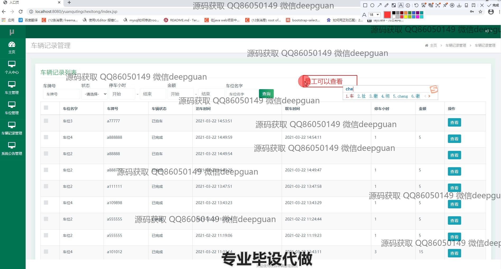

<h1 align="center">基于JAVAEE技术校园车辆管理系统</h1>

## 简介
校园车辆管理系统：角色分为管理员和员工；包含登录注册、员工管理、车主管理、车辆信息、停车记录、车位管理、系统公告管理等功能，方便车辆及信息的综合管理。    --计算机毕业设计源码；毕设源码；java毕业设计源码

## 联系方式

<h3 align="center">获取完整代码与数据库文件 + 微信：deepguan QQ: 86050149 QQ群: 783742310</h3>

<h3 align="center">可帮忙远程部署 包运行成功！提供远程部署、修改代码、设计文档指导、代码讲解等服务！</h3>

## 功能介绍（完整见运行截图）
管理员：基本功能包括登录、注册、退出、修改密码等。系统主页提供导航至个人中心、员工管理、车主管理、车辆管理、车位管理、车辆记录管理和系统公告管理。管理员可以新增、查看、修改和删除员工信息、车主信息、车辆信息及车位信息，支持对车辆记录进行筛选查询、统计和管理。同时具备公告发布、修改和删除功能，确保系统信息透明化。

员工：基本功能包括登录、注册和密码修改。可通过系统查看个人信息、公告信息和与其权限相关的车辆或车位数据。能够协助录入或查询车主信息及车辆停泊记录，确保系统数据更新及时。

车主：基本功能包括登录和密码修改。车主可以通过系统查看与自己车辆相关的停车记录，包括车位状态、停车时间及费用，同时能通过车牌号进行查询，方便管理个人信息和停车记录。

访客：可通过系统登录页面注册新账户，系统主页提供车辆和停车管理模块的概览，协助了解车辆管理功能和可操作范围。

## 运行截图

本代码来源于网络,仅供学习参考使用!

